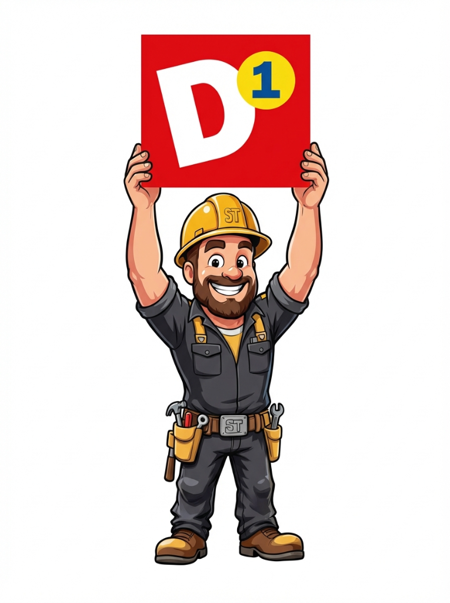

# 🎨 Guía de Marca - Su Todero D1

## 🎯 Identidad Visual

### Logo


El logo de Su Todero D1 presenta al personaje "ST" (Su Todero) con su característico casco de constructor dorado, sosteniendo el icono "D1" que representa la excelencia y liderazgo en el mercado.

**Ubicaciones del logo:**
- Web: `web/public/logo-sutodero-d1.png`
- Mobile: `mobile/assets/logo-sutodero-d1.png`

---

## 🎨 Paleta de Colores

### Colores Principales

#### Negro Puro
- **Hex**: `#000000`
- **RGB**: `0, 0, 0`
- **Uso**: Fondos principales, texto sobre fondos claros, navbar

#### Blanco Puro
- **Hex**: `#FFFFFF`
- **RGB**: `255, 255, 255`
- **Uso**: Texto sobre fondos oscuros, cards, áreas de contenido

#### Dorado Elegante (Primary)
- **Hex**: `#D4AF37`
- **RGB**: `212, 175, 55`
- **Uso**: Botones primarios, acentos, elementos interactivos, títulos destacados

### Colores Secundarios

#### Negro Suave
- **Hex**: `#0A0A0A`
- **RGB**: `10, 10, 10`
- **Uso**: Fondos alternativos, secciones destacadas

#### Negro Claro
- **Hex**: `#1A1A1A`
- **RGB**: `26, 26, 26`
- **Uso**: Hover states, elementos terciarios

#### Dorado Oscuro (Secondary)
- **Hex**: `#B8960F`
- **RGB**: `184, 150, 15`
- **Uso**: Gradientes con dorado principal, hover states

#### Blanco Suave
- **Hex**: `#F5F5F5`
- **RGB**: `245, 245, 245`
- **Uso**: Fondos de página, áreas de contenido secundario

### Colores de Texto

- **Texto Oscuro**: `#000000` - Sobre fondos claros
- **Texto Gris**: `#333333` - Texto secundario
- **Texto Claro**: `#FFFFFF` - Sobre fondos oscuros
- **Texto Dorado**: `#D4AF37` - Énfasis y títulos

### Colores de Estado

- **Success**: `#D4AF37` (Dorado)
- **Warning**: `#E6C84A` (Dorado claro)
- **Danger**: `#DC3545` (Rojo)

---

## 📐 Uso de Colores

### Combinaciones Recomendadas

#### Combinación 1: Elegancia Máxima
```css
Fondo: Negro (#000000)
Texto: Blanco (#FFFFFF)
Acentos: Dorado (#D4AF37)
```

#### Combinación 2: Limpio y Profesional
```css
Fondo: Blanco (#FFFFFF)
Texto: Negro (#000000)
Acentos: Dorado (#D4AF37)
```

#### Combinación 3: Contraste Suave
```css
Fondo: Negro Suave (#0A0A0A)
Texto: Blanco (#FFFFFF)
Acentos: Dorado (#D4AF37)
```

### Gradientes

#### Gradiente Dorado (Botones Primarios)
```css
linear-gradient(135deg, #D4AF37 0%, #B8960F 100%)
```

#### Gradiente Negro (Hero/Header)
```css
linear-gradient(135deg, #000000 0%, #1A1A1A 50%, #0A0A0A 100%)
```

#### Gradiente con Efecto Dorado (Backgrounds)
```css
linear-gradient(135deg, #000000 0%, #1A1A1A 50%, #D4AF37 100%)
```

---

## 🎭 Efectos y Sombras

### Sombras Doradas
```css
box-shadow: 0 4px 15px rgba(212, 175, 55, 0.3);
```

### Sombras de Texto Dorado
```css
text-shadow: 0 0 20px rgba(212, 175, 55, 0.5);
```

### Borders Dorados
```css
border: 1px solid rgba(212, 175, 55, 0.2);
```

### Resplandor Dorado (Hover)
```css
box-shadow: 0 6px 20px rgba(212, 175, 55, 0.5);
```

---

## 🔤 Tipografía

### Fuentes
```css
font-family: -apple-system, BlinkMacSystemFont, 'Segoe UI', 'Roboto', 
             'Oxygen', 'Ubuntu', 'Cantarell', 'Fira Sans', 
             'Droid Sans', 'Helvetica Neue', sans-serif;
```

### Jerarquía

#### H1 - Títulos Principales
- **Size**: `3.5rem` (56px)
- **Weight**: `800` (Extra Bold)
- **Color**: Dorado `#D4AF37`
- **Text Shadow**: `0 0 20px rgba(212, 175, 55, 0.5)`

#### H2 - Títulos Secundarios
- **Size**: `2.5rem` (40px)
- **Weight**: `700` (Bold)
- **Color**: Negro `#000000` o Dorado según contexto

#### H3 - Subtítulos
- **Size**: `1.5rem` (24px)
- **Weight**: `600` (Semi Bold)
- **Color**: Negro `#000000`

#### Body Text
- **Size**: `1rem` (16px)
- **Weight**: `400` (Regular)
- **Line Height**: `1.5`

### Estilos de Texto

#### Uppercase con Espaciado
```css
text-transform: uppercase;
letter-spacing: 0.5px;
```
*Uso*: Botones, etiquetas, categorías

#### Dorado con Resplandor
```css
color: #D4AF37;
text-shadow: 0 0 10px rgba(212, 175, 55, 0.3);
```
*Uso*: Títulos destacados, logos, enlaces importantes

---

## 🖼️ Uso del Logo

### Espaciado Mínimo
Mantén un espacio libre alrededor del logo equivalente a la altura del casco del personaje.

### Tamaños Recomendados

#### Web
- **Navbar**: 50px de altura
- **Footer**: 60px de altura
- **Hero**: 100-150px de altura

#### Mobile
- **Header**: 40-50px de altura
- **Splash Screen**: 150-200px de altura

### Fondos Permitidos

✅ **Sobre Negro**: Excelente contraste  
✅ **Sobre Blanco**: (Con sombra o borde sutil)  
✅ **Sobre Degradado Oscuro**: Perfecto  
❌ **Sobre Fondos Complejos**: Evitar  
❌ **Sobre Colores Brillantes**: Evitar

---

## 🎨 Componentes UI

### Botones

#### Botón Primario
```css
background: linear-gradient(135deg, #D4AF37 0%, #B8960F 100%);
color: #000000;
box-shadow: 0 4px 15px rgba(212, 175, 55, 0.3);
text-transform: uppercase;
letter-spacing: 0.5px;
```

**Hover:**
```css
transform: translateY(-2px);
box-shadow: 0 6px 20px rgba(212, 175, 55, 0.5);
```

#### Botón Secundario
```css
background-color: transparent;
color: #FFFFFF;
border: 2px solid #D4AF37;
```

**Hover:**
```css
background-color: #D4AF37;
color: #000000;
```

### Cards

```css
background: #FFFFFF;
border-radius: 12px;
box-shadow: 0 4px 15px rgba(0, 0, 0, 0.1);
border: 1px solid rgba(212, 175, 55, 0.2);
```

**Hover:**
```css
transform: translateY(-8px);
box-shadow: 0 8px 30px rgba(212, 175, 55, 0.3);
border-color: #D4AF37;
```

---

## 📱 Plataformas

### Web
- Navbar: Fondo negro con borde dorado inferior
- Hero: Degradado negro con resplandor dorado
- Cards: Blancas con borde dorado sutil
- Footer: Fondo negro con borde dorado superior

### Mobile
- StatusBar: Negro
- Header: Negro con título dorado
- Cards: Blancas con sombra dorada
- Tab Bar: Activo en dorado

---

## ✅ Dos y Don'ts

### ✅ Hacer

- Usar negro puro y blanco puro para máximo contraste
- Aplicar dorado para elementos interactivos
- Usar sombras doradas sutiles
- Mantener espaciado generoso
- Usar gradientes para profundidad

### ❌ No Hacer

- No usar grises en lugar de negro/blanco
- No saturar con dorado (usarlo estratégicamente)
- No mezclar con otros colores vibrantes
- No usar el logo sobre fondos complejos
- No distorsionar el logo

---

## 🎯 Principios de Diseño

1. **Elegancia**: Negro y dorado transmiten lujo y profesionalismo
2. **Contraste**: Blanco y negro puros garantizan legibilidad
3. **Sofisticación**: Uso estratégico del dorado como acento
4. **Minimalismo**: Espacios limpios, sin elementos innecesarios
5. **Profesionalismo**: Tipografía clara y jerarquía bien definida

---

## 📦 Archivos de Recursos

### Logo
- **PNG**: `logo-sutodero-d1.png` (Alta resolución, fondo transparente)

### Colores (Código)
- **Web**: `web/src/index.css` (Variables CSS)
- **Mobile**: `mobile/src/theme/colors.js` (JavaScript)

---

## 📞 Contacto

Para consultas sobre el uso de la marca o solicitud de recursos adicionales, contacta al equipo de diseño de Su Todero D1.

---

**Versión de la Guía**: 1.0  
**Última Actualización**: 2026-02-02  
**Proyecto**: Su Todero D1 - Firebase: Sutoderoapp
